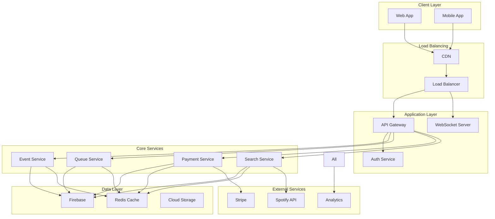
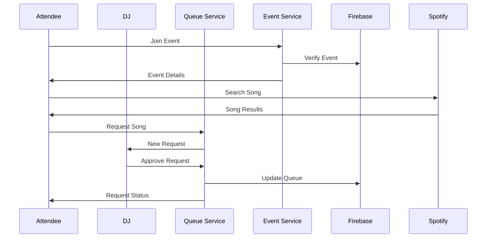
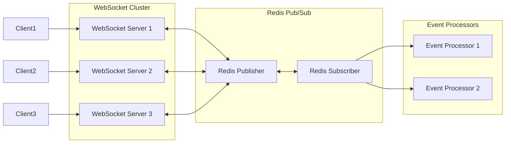

# OneSong Detailed Architecture

## 1. System Overview

```mermaid
graph TB
    subgraph Client Layer
        Web[Web App]
        Mobile[Mobile App]
    end

    subgraph Load Balancing
        LB[Load Balancer]
        CDN[CDN]
    end

    subgraph Application Layer
        API[API Gateway]
        WS[WebSocket Server]
        Auth[Auth Service]
    end

    subgraph Core Services
        Event[Event Service]
        Queue[Queue Service]
        Payment[Payment Service]
        Search[Search Service]
    end

    subgraph Data Layer
        FB[Firebase]
        Redis[Redis Cache]
        Storage[Cloud Storage]
    end

    subgraph External Services
        Stripe[Stripe]
        Spotify[Spotify API]
        Analytics[Analytics]
    end

    Web & Mobile --> CDN
    CDN --> LB
    LB --> API & WS
    API --> Auth
    API --> Event & Queue & Payment & Search
    Event & Queue & Payment & Search --> FB & Redis
    Payment --> Stripe
    Search --> Spotify
    All --> Analytics
```

## 2. Data Flow Architecture

```mermaid
sequenceDiagram
    participant A as Attendee
    participant DJ as DJ
    participant Q as Queue Service
    participant E as Event Service
    participant DB as Firebase
    participant S as Spotify

    A->>E: Join Event
    E->>DB: Verify Event
    E->>A: Event Details
    A->>S: Search Song
    S->>A: Song Results
    A->>Q: Request Song
    Q->>DJ: New Request
    DJ->>Q: Approve Request
    Q->>DB: Update Queue
    Q->>A: Request Status
```

## 3. Real-time Communication

```mermaid
graph LR
    subgraph WebSocket Cluster
        WS1[WebSocket Server 1]
        WS2[WebSocket Server 2]
        WS3[WebSocket Server 3]
    end

    subgraph Redis Pub/Sub
        RP[Redis Publisher]
        RS[Redis Subscriber]
    end

    subgraph Event Processors
        EP1[Event Processor 1]
        EP2[Event Processor 2]
    end

    Client1 --> WS1
    Client2 --> WS2
    Client3 --> WS3
    WS1 & WS2 & WS3 <--> RP
    RP <--> RS
    RS --> EP1 & EP2
``` 