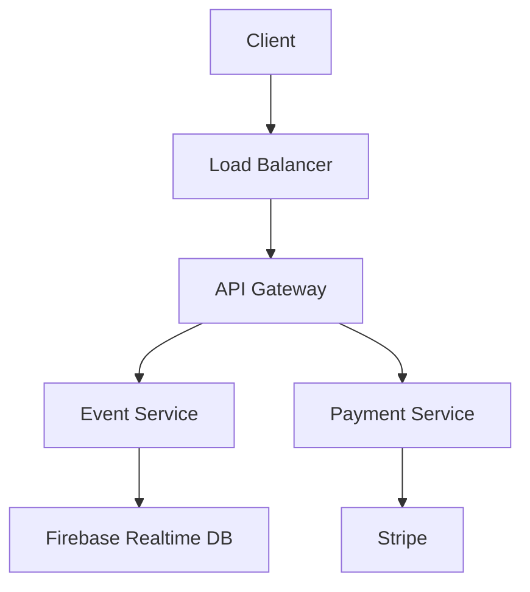

# OneSong System Architecture

## Overview
OneSong is a distributed real-time system built on Firebase with the following key components:

### Core Services
1. **Authentication Service**
   - Firebase Authentication
   - Custom role management
   - Session handling

2. **Event Management**
   - Real-time event updates
   - Queue management
   - Request processing

3. **Payment Processing**
   - Stripe integration
   - Webhook handling
   - Transaction management

### Data Flow

### Security Architecture
1. **Authentication Flow**
   - JWT token validation
   - Role-based access control
   - Session management

2. **Data Protection**
   - End-to-end encryption
   - Secure webhook handling
   - Rate limiting 